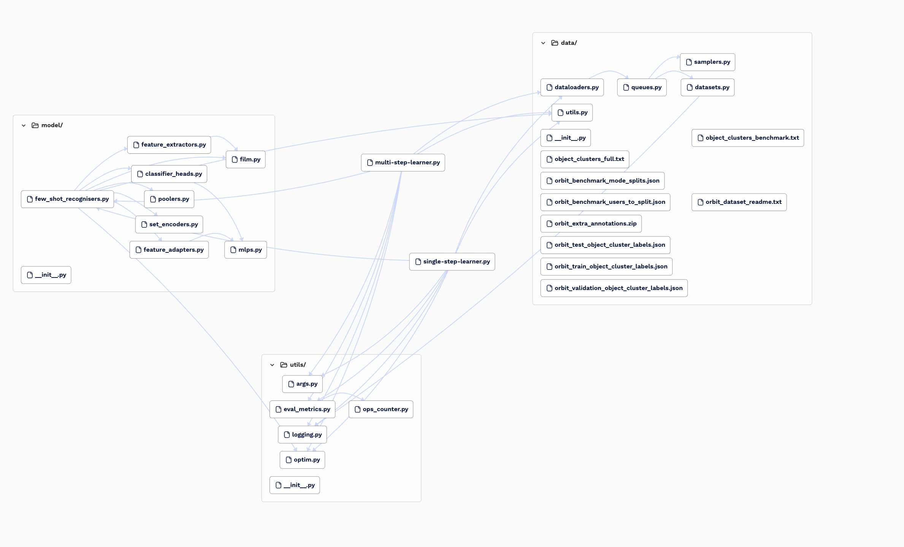

<!-- https://app.codesee.io/maps/e6cb4840-c951-11ee-b402-6d85204823e2


trying to run baseline 2022 -->
 # Enhancing Few-Shot Recognition: An initial study on the effectiveness of Informative Filter Network on Lightweight Architectures
 
 ## Abstract
In this work we present our preliminary solution for ORBIT 2024 challenge. Our work introduces IF-Net, an optimized, lightweight neural
network designed specifically to improve the efficiency and
accuracy of teachable object recognizers, which are critical in assisting visually impaired individuals in locating personal belongings. Employing an advanced sampling
strategy, IF-Net selectively identifies the most informative
frames from video data, optimizing the training data quality
and enabling more effective learning with constrained com-
putational resources. Moreover, our study includes an in-
depth performance analysis and an ablation study focused
on the impact of hyperparameter variations on final accu-
racy. Additionally, our study facilitates efficient training
and testing on a single NVIDIA RTX 4090 GPU, further underscoring the scalability and practicality of our approach.

## Contribution
We present the code that integrates the IF-Net for extracting informative data points from the test set and provide the code incorporating feature extractor backbones more suitable for edge device deployment, namely:
- Phinet
- Mobilinet_v3
## Team Members
- Sebastian Cavada
- Branislava Jankovic
- Kamila Zhumakhanova

## Dataset 
We chose the 224*224 version of the ORBIT dataset. Please, follow the guidelines of the [official ORBIT githib page](https://github.com/microsoft/ORBIT-Dataset?tab=readme-ov-file#download-orbit-benchmark-dataset) to download the dataset along with the [annotations](https://github.com/microsoft/ORBIT-Dataset?tab=readme-ov-file#download-orbit-benchmark-dataset). Check that the folder includes train, validation, test sets of video frame images and their annotations, following the format:


```
/ORBIT_microsoft
|
|--- train/
      |--- P100/
      |--- exercise bench/
      |------------clean/
      |---------------P100--exercise-bench--clean--4ChvjQ3Xzidvq0mCI9lperemxb6D6tCyQS-BG6LS72A/
      |------------------ P100--exercise-bench--clean--4ChvjQ3Xzidvq0mCI9lperemxb6D6tCyQS-BG6LS72A-00001.jpg
      |------------------ P100--exercise-bench--clean--4ChvjQ3Xzidvq0mCI9lperemxb6D6tCyQS-BG6LS72A-00002.jpg
      ...
      
|--- validation/
|--- test/
|--- annotation/ 
      |------ orbit_extra_annotations/
      |------ orbit_train_object_cluster_labels.json
      |------ orbit_validation_object_cluster_labels.json
      |------ orbit_test_object_cluster_labels.json
```

Change the data root path, `data.train_cfg.root = your_orbit_dataset_folder_path`, `data.val_cfg.root = your_orbit_dataset_folder_path` and
`data.test_cfg.root = your_orbit_dataset_folder_path`. [See example here](https://github.com/Sebo-the-tramp/orbit-challenge-2024/blob/main/pytorchlightning_trainer/conf/data/default_use_data_aug.yaml#L8)
## Installation

Git clone the repository

```
git clone https://github.com/Sebo-the-tramp/orbit-challenge-2024.git
cd orbit-challenge-2024
```

Create conda enviromnent 

```
conda create -n flash python=3.8
conda activate flash
pip install -r requirements.txt
```
If you face issues with installation of torchvision, run this:
```
pip install torch==1.13.1+cu117 torchvision==0.14.1+cu117 torchaudio==0.13.1 --extra-index-url https://download.pytorch.org/whl/cu117
```
Add these variables to .bashrc or just run in the command line
```
export PROJECT_ROOT=./
export PYTHONPATH=./
export HYDRA_FULL_ERROR=1
export SLURM_NTASKS=1
```
## To run the training
- In `pytorchlightning/conf/data/default_use_data_aug.yaml` change the root to the path to your dataset and number of episodes per user (we used 50 for faster training)
- In `pytorchlightning/conf/model/feat_with_lite.yaml` change the path to the feature extractor pretrained weights and the model name
- Start the training by running:
```
python run.py 
data=default_use_data_aug     
model=feat_with_lite
train=with_lite_train 
train.exp_name="phinet_50__whole dataset"
```
- or simply run 

```
sh start_train.sh
```
## To run the testing
- In `pytorchlightning/conf/data/test_support_sampler_uniform_fixed_chunk_size_10.yaml` change the root to the path to your dataset and number of episodes per user (we used 50 for faster training)
- In `pytorchlightning/conf/model/feat_with_lite_video_post_improved.yaml` change the path to the feature extractor pretrained weights and the model name
- In `pytorchlightning/conf/train/with_lite_test.yaml` change the path to the last checkpoint of the trained model
- Start the testing by running:
```
python run.py
data=test_support_sampler_uniform_fixed_chunk_size_10 
model=feat_with_lite_video_post_improved
train=with_lite_test 
train.exp_name="reproduce_our_results"
```
or simply run 

```
sh start_test.sh
