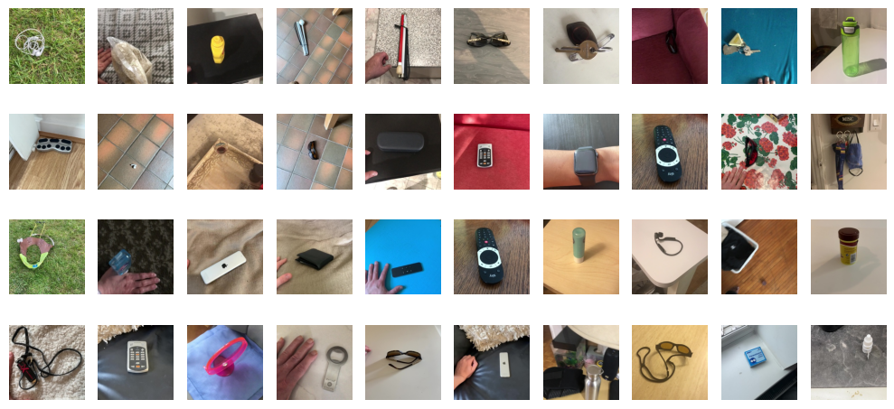

# Research Paper To-Do List

## Ablation study

### Study the effect of the database difference for different backbones

| Name                     |  Average Frame Accuracy  | Confidence Interval   |
|--------------------------|--------------------------|-----------------------|
| EfficientNet - big dataset - 50    | -      |  -   |
| EfficientNet - small dataset - 50  | -      |  -   |
| Phinet - big dataset - 50    | -      |  -   |
| Phinet - small dataset - 50  | -      |  -   |
| MobileVIT - big dataset - 50    | -      |  -   |
| MobileVIT - small dataset - 50  | -      |  -   |

Good images:

Bad images:

### Study the effect in the change in the number of epochs for different backbones 

| Name                     |  Average Frame Accuracy  | Confidence Interval   |
|--------------------------|--------------------------|-----------------------|
| EfficientNet - 50    | -      |  -   |
| EfficientNet - 500  | -      |  -   |
| Phinet - 50    | -      |  -   |
| Phinet - 500  | -      |  -   |
| MobileVIT - 50    | -      |  -   |
| MobileVIT - 500  | -      |  -   |

### Study of the effect of self supervised pretraining on the downstream task (initial investigation)

| Name                     |  Average Frame Accuracy  | Confidence Interval   |
|--------------------------|--------------------------|-----------------------|
| Phinet - 50    | -      |  -   |
| Phinet - 500  | -      |  -   |

## Some tricks

| Name                     |  Average Frame Accuracy  | Confidence Interval   |
|--------------------------|--------------------------|-----------------------|
| Phinet - 50 - Postprocessing   | -      |  -   |
| Phinet - 50 - Majority voting   | -      |  -   |
| Phinet - 50 - Something else?   | -      |  -   |

