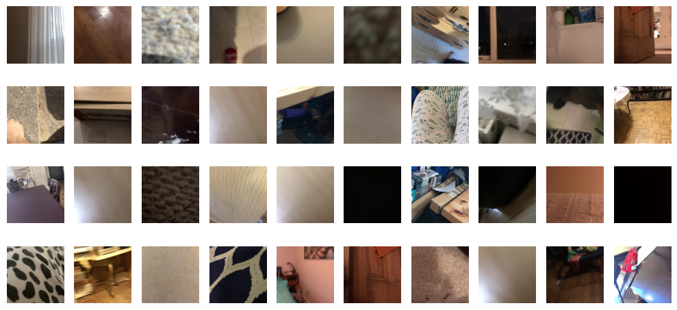

# Research Paper To-Do List

# 12.04.2024 
- two new datasets
- third table with strategies

# 13.04.2024
- 

Data type:

- big: original dataset
- small:
  - train -> gt_labels
  - clutter -> filtered with obj
  - test -> if_net
  - clutter -> filtered with obj 

## Ablation study

### Study the effect of the database difference for different backbones

| Name                     |  Average Frame Accuracy  | Confidence Interval   |  WHO | Status |
|--------------------------|--------------------------|-----------------------|------|--------|
| EfficientNet - big dataset - 50    | 0.6519797086743283 | 0.03974051029645851 |  Sebastian | Done |
| EfficientNet - small dataset - 50  | 0.6530725011837245 | 0.03935080769579349 | Sebastian | Done - ws-l5-008 |
| EfficientNet - big dataset - 500  |  0.6781074918554808 | 0.0386619883365546  | Sebastian | Done - Kami02 |
| EfficientNet - small dataset - 500  | 0.6704734775094003  | 0.03857772670822  | Sebastian | Done - Kami02 |
| Phinet - big dataset - 50    | 0.5969983820930811      |  0.04065243122345036   | Brana | Done |

| Phinet - small dataset - 50  | 0.6319738170536263     |  0.04035598926922223 | Sebastian | Done - ws-l5-008  |
| MobileVIT - big dataset - 50    | 0.1336326131163907      |  0.03007068532365992   | Brana | Done |
| MobileVIT - small dataset - 50  | NONE | NONE | Unknown | Unknown |

[//]: # (| Phinet - big dataset - 50 - 1 epoch  | 0.6045990629830172      |  0.04094082216687125   | Sebastian | Done |)
[//]: # ( | Phinet - small dataset - 50 max support sampler instead of random  | 0.62288852918077     | 0.04046261139498393 | Sebastian | Done - ws-l5-008  |)

Description of the dataset types:
- *big*: original
- *medium*: **dropped:** 'object_not_present_issue', 'occlusion_issue', 'blur_issue' + IFnetwork in test clean 
- *small*: only the best images in the dataset + IFnetwork in test clean 
 
| Name                     |  Average Frame Accuracy  | Confidence Interval   |  WHO | Status |
|--------------------------|--------------------------|-----------------------|------|--------|
| Phinet - big dataset - 50  (1.8 mil. images)  | 0.5969983820930811      |  0.04065243122345036   | Brana | Done |
| Phinet - medium dataset - 50 (1.3 mil. images) | 0.6195229377169459     | 0.04087509739856873 | Kami | Done |
| Phinet - small dataset - 50 (1.1 mil. images) |  0.6319738170536263     |   0.04035598926922223  | Sebastian | Done  |

### Study the effect in the change in the number of epochs for different backbones (big db)

| Name                     |  Average Frame Accuracy  | Confidence Interval   |  WHO | Status |
|--------------------------|--------------------------|-----------------------|------|--------|
| EfficientNet - 50  (big db) | 0.6519797086743283 | 0.03974051029645851 |  Sebastian | Done |
| EfficientNet - 500 (big db) | 0.6704734775094003  | 0.03857772670822  | Sebastian | Done |
| Phinet - 50 (big db)   | 0.5969983820930811      |  0.04065243122345036   | Brana | Done |
| Phinet - 500 (big db)  | 0.6083022641687181      |  0.040819703094845325  | Sebastian | Done - Kami02 |
| MobileVIT - 50 (big db)   | 0.1336326131163907      |  0.03007068532365992   | Brana | Done |
| MobileVIT - 500 (big db)  | 0.13363261311639074 | 0.030070685323659915 | Brana | Done |

### Study of the effect of self-supervised pretraining on the downstream task (initial investigation)

| Name                     |  Average Frame Accuracy  | Confidence Interval   |  WHO | Status |
|--------------------------|--------------------------|-----------------------|------|--------|
| Phinet - 50 - Imagenet 20% acc | -      |  -   | Unknown | Unknown |
| Phinet - 500 - Imagenet 20% acc | -      |  -   | Unknown | Unknown |
| Phinet - 50 - Cifar 50% acc | -      |  -   | Unknown | Unknown |
| Phinet - 500 - Cifar 50% acc | -      |  -   | Unknown | Unknown |

## Some tricks

| Name                     |  Average Frame Accuracy  | Confidence Interval   |  WHO | Status |
|--------------------------|--------------------------|-----------------------|------|--------|
| Phinet - 50 - Postprocessing   | -      |  -   | Unknown | Unknown |
| Phinet - 50 - Majority voting   | -      |  -   | Unknown | Unknown |
| Phinet - 50 - Something else?   | -      |  -   | Unknown | Unknown |

TODO:

- [ ] take away the folders with less than 50 images, to exclude them from testing
- [ ] fix macs calculation to export correctly to json file

NOTE:
we can also write about the images that contain both objects that could both belong to some personalization objects -> AMBIGUITIES

Good images:

Bad images:

